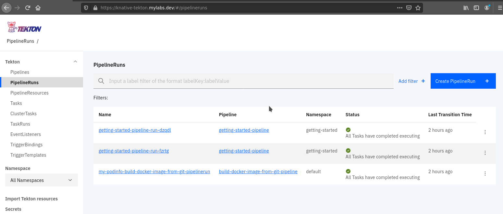

# Install Knative

Set Knative version variable:

```bash
export KNATIVE_VERSION="v0.11.0"
```

Install Knative:

```bash
kubectl apply --selector knative.dev/crd-install=true \
   --filename https://github.com/knative/serving/releases/download/${KNATIVE_VERSION}/serving.yaml \
   --filename https://github.com/knative/eventing/releases/download/${KNATIVE_VERSION}/release.yaml \
   --filename https://github.com/knative/serving/releases/download/${KNATIVE_VERSION}/monitoring.yaml
kubectl apply \
   --filename https://github.com/knative/serving/releases/download/${KNATIVE_VERSION}/serving.yaml \
   --filename https://github.com/knative/eventing/releases/download/${KNATIVE_VERSION}/release.yaml \
   --filename https://github.com/knative/serving/releases/download/${KNATIVE_VERSION}/monitoring.yaml
sleep 60
```

Install Tekton with Dashboard (do not increase Tekton version above 0.8.0):

```bash
kubectl apply --filename https://github.com/tektoncd/pipeline/releases/download/v0.8.0/release.yaml
kubectl apply --filename https://github.com/tektoncd/dashboard/releases/download/v0.3.0/dashboard-latest-release.yaml
```

Install Tekton Triggers:

```bash
kubectl apply --filename https://github.com/tektoncd/triggers/releases/download/v0.1.0/release.yaml
```

Export Knative services ([Prometheus](https://prometheus.io/) and
[Grafana](https://grafana.com/)) to be visible externally:

```bash
cat << EOF | kubectl apply -f -
apiVersion: networking.istio.io/v1alpha3
kind: Gateway
metadata:
  name: knative-services-gateway
  namespace: knative-monitoring
spec:
  selector:
    istio: ingressgateway
  servers:
  - port:
      number: 80
      name: http-knative-services
      protocol: HTTP
    hosts:
    - knative-grafana.${MY_DOMAIN}
    - knative-prometheus.${MY_DOMAIN}
    - knative-tekton.${MY_DOMAIN}
  - port:
      number: 443
      name: https-knative-services
      protocol: HTTPS
    hosts:
    - knative-grafana.${MY_DOMAIN}
    - knative-prometheus.${MY_DOMAIN}
    - knative-tekton.${MY_DOMAIN}
    tls:
      credentialName: ingress-cert-${LETSENCRYPT_ENVIRONMENT}
      mode: SIMPLE
      privateKey: sds
      serverCertificate: sds
---
apiVersion: networking.istio.io/v1alpha3
kind: VirtualService
metadata:
  name: grafana-virtual-service
  namespace: knative-monitoring
spec:
  hosts:
  - "knative-grafana.${MY_DOMAIN}"
  gateways:
  - knative-services-gateway
  http:
  - route:
    - destination:
        host: grafana.knative-monitoring.svc.cluster.local
        port:
          number: 30802
---
apiVersion: networking.istio.io/v1alpha3
kind: VirtualService
metadata:
  name: prometheus-virtual-service
  namespace: knative-monitoring
spec:
  hosts:
  - "knative-prometheus.${MY_DOMAIN}"
  gateways:
  - knative-services-gateway
  http:
  - route:
    - destination:
        host: prometheus-system-np.knative-monitoring.svc.cluster.local
        port:
          number: 8080
---
apiVersion: networking.istio.io/v1alpha3
kind: VirtualService
metadata:
  name: tekton-virtual-service
  namespace: knative-monitoring
spec:
  hosts:
  - "knative-tekton.${MY_DOMAIN}"
  gateways:
  - knative-services-gateway
  http:
  - route:
    - destination:
        host: tekton-dashboard.tekton-pipelines.svc.cluster.local
        port:
          number: 9097
EOF
```

Tekton Dashboard:



Set up a custom domain for Knative:

```bash
cat << EOF | kubectl apply -f -
apiVersion: v1
kind: ConfigMap
metadata:
  name: config-domain
  namespace: knative-serving
data:
  ${MY_DOMAIN}: ""
EOF
```

Changing the controller deployment is needed if you are not using the valid
certificates (self-signed):

```bash
if [ ${LETSENCRYPT_ENVIRONMENT} = "staging" ]; then
  kubectl --namespace knative-serving create secret generic customca --from-file=customca.crt=tmp/fakelerootx1.pem
  kubectl patch deployment controller --namespace knative-serving --patch "
    {
        \"spec\": {
            \"template\": {
                \"spec\": {
                    \"containers\": [{
                        \"env\": [{
                            \"name\": \"SSL_CERT_DIR\",
                            \"value\": \"/etc/customca\"
                        }],
                        \"name\": \"controller\",
                        \"volumeMounts\": [{
                            \"mountPath\": \"/etc/customca\",
                            \"name\": \"customca\"
                        }]
                    }],
                    \"volumes\": [{
                        \"name\": \"customca\",
                        \"secret\": {
                            \"defaultMode\": 420,
                            \"secretName\": \"customca\"
                        }
                    }]
                }
            }
        }
    }"
fi
```

## Enable automatic TLS certificate provisioning for Knative

Install `networking-certmanager`:

```bash
kubectl apply --filename https://github.com/knative/serving/releases/download/${KNATIVE_VERSION}/serving-cert-manager.yaml
```

Update your `config-certmanager` ConfigMap in the `knative-serving` namespace to
define your new ClusterIssuer configuration and your your DNS provider:

```bash
cat << EOF | kubectl apply -f -
apiVersion: v1
kind: ConfigMap
metadata:
  name: config-certmanager
  namespace: knative-serving
  labels:
    networking.knative.dev/certificate-provider: cert-manager
data:
  issuerRef: |
    kind: ClusterIssuer
    name: letsencrypt-${LETSENCRYPT_ENVIRONMENT}-dns
  solverConfig: |
    dns01:
      provider: aws-route53
EOF
```

Update the `config-network` ConfigMap in the `knative-serving` namespace to enable
`autoTLS`:

```bash
cat << EOF | kubectl apply -f -
apiVersion: v1
kind: ConfigMap
metadata:
  name: config-network
  namespace: knative-serving
data:
  autoTLS: Enabled
  httpProtocol: Enabled
EOF
```
