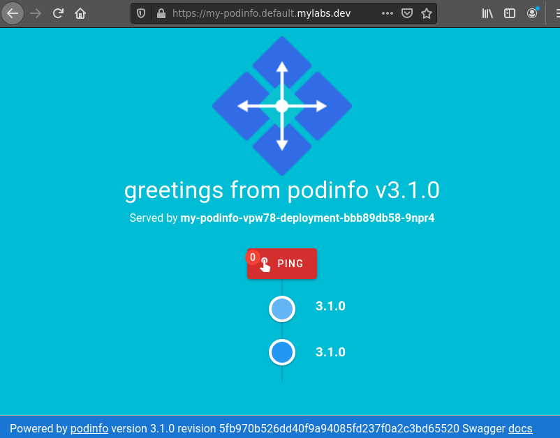

# Build and run container image using Knative + Tekton

Set the necessary variables:

```bash
export GIT_REPOSITORY="git@gitlab.${MY_DOMAIN}:myuser/my-podinfo.git"
export GIT_REVISION="3.1.0"
export GIT_REPO_SSH_KEY="tmp/id_rsa_gitlab"
export CONTAINER_REGISTRY="harbor.${MY_DOMAIN}/library/my-podinfo"
export CONTAINER_REGISTRY_USERNAME="robot\$myrobot"
export CONTAINER_REGISTRY_PASSWORD="${HARBOR_ROBOT_TOKEN}"

export GIT_PROJECT_NAME=$( echo ${GIT_REPOSITORY} | sed "s@.*/\(.*\).git@\1@; s/\./\-/" )
export CONTAINER_REGISTRY_SERVER=$( echo $CONTAINER_REGISTRY | awk -F / "{ print \$1 }" )
export CONTAINER_REGISTRY_SERVER_MODIFIED=$( echo $CONTAINER_REGISTRY | awk -F / "{ gsub(/\./,\"-\"); print \$1 }" )
export GIT_SSH_SERVER=$( echo $GIT_REPOSITORY | awk -F "[@:]" "{ print \$2}" )
export GIT_SSH_SERVER_MODIFIED=$( echo $GIT_REPOSITORY | awk -F "[@:]" "{ gsub(/\./,\"-\"); print \$2 }" )
```

Create secret for Harbor registry to let Tekton pipeline to upload the container
image:

```bash
kubectl create secret docker-registry ${CONTAINER_REGISTRY_SERVER_MODIFIED}-docker-config \
  --docker-server="${CONTAINER_REGISTRY_SERVER}" \
  --docker-username="${CONTAINER_REGISTRY_USERNAME}" \
  --docker-password="${CONTAINER_REGISTRY_PASSWORD}"
```

Create secret for AWS user to allow Tekton pipeline to push binary to S3:

```bash
kubectl create secret generic user-aws-access-keys --from-literal=access_key=$USER_AWS_ACCESS_KEY_ID --from-literal=secret_key=$USER_AWS_SECRET_ACCESS_KEY
```

Create + start Tekton pipeline (and it's components) to build the container
image:

```bash
cat << EOF | kubectl apply -f -
apiVersion: v1
kind: Secret
type: kubernetes.io/ssh-auth
metadata:
  name: ${GIT_SSH_SERVER_MODIFIED}-ssh-key
  annotations:
    tekton.dev/git-0: ${GIT_SSH_SERVER}
data:
  ssh-privatekey: $(base64 -w 0 ${GIT_REPO_SSH_KEY})
---
apiVersion: v1
kind: ServiceAccount
metadata:
  name: ${GIT_SSH_SERVER_MODIFIED}-build-bot
secrets:
  - name: ${GIT_SSH_SERVER_MODIFIED}-ssh-key
---
apiVersion: tekton.dev/v1alpha1
kind: PipelineResource
metadata:
  name: ${GIT_PROJECT_NAME}-project-git
  namespace: default
spec:
  type: git
  params:
    - name: url
      value: ${GIT_REPOSITORY}
    - name: revision
      value: ${GIT_REVISION}
---
apiVersion: tekton.dev/v1alpha1
kind: PipelineResource
metadata:
  name: ${GIT_PROJECT_NAME}-project-image
spec:
  type: image
  params:
    - name: url
      value: ${CONTAINER_REGISTRY}:${GIT_REVISION}
---
apiVersion: tekton.dev/v1alpha1
kind: Task
metadata:
  name: build-docker-image-from-git-task
spec:
  inputs:
    resources:
      - name: docker-source
        type: git
    params:
      - name: pathToDockerFile
        description: The path to the dockerfile to build
        default: /workspace/docker-source/Dockerfile
      - name: pathToContext
        description:
          The build context used by Kaniko
          (https://github.com/GoogleContainerTools/kaniko#kaniko-build-contexts)
        default: /workspace/docker-source
  outputs:
    resources:
      - name: builtImage
        type: image
  volumes:
    - name: docker-config
      secret:
        secretName: ${CONTAINER_REGISTRY_SERVER_MODIFIED}-docker-config
        items:
          - key: .dockerconfigjson
            path: config.json
    - name: shared-storage
      emptyDir: {}
  steps:
    - name: build-and-tar
      image: gcr.io/kaniko-project/executor
      command:
        - /kaniko/executor
      args:
        - --dockerfile=\$(inputs.params.pathToDockerFile)
        - --destination=\$(outputs.resources.builtImage.url)
        - --context=\$(inputs.params.pathToContext)
        - --single-snapshot
        - --tarPath=/shared-storage/${USER}-app-build.tar
        - --no-push
      volumeMounts:
        - name: docker-config
          mountPath: /builder/home/.docker/
        - name: shared-storage
          mountPath: /shared-storage
    - name: upload-container-content-s3
      image: atlassian/pipelines-awscli
      command: ["sh", "-x", "-c", "ls -la /shared-storage/ ; aws s3 cp /shared-storage/${USER}-app-build.tar s3://${USER}-kops-k8s/"]
      env:
        - name: AWS_DEFAULT_REGION
          value: "eu-central-1"
        - name: AWS_ACCESS_KEY_ID
          valueFrom:
            secretKeyRef:
              name: user-aws-access-keys
              key: access_key
        - name: AWS_SECRET_ACCESS_KEY
          valueFrom:
            secretKeyRef:
              name: user-aws-access-keys
              key: secret_key
      volumeMounts:
        - name: shared-storage
          mountPath: /shared-storage
    - name: build-and-push
      image: gcr.io/kaniko-project/executor
      env:
        - name: "DOCKER_CONFIG"
          value: "/builder/home/.docker/"
      command:
        - /kaniko/executor
      args:
        - --dockerfile=\$(inputs.params.pathToDockerFile)
        - --destination=\$(outputs.resources.builtImage.url)
        - --context=\$(inputs.params.pathToContext)
        - --single-snapshot
        - --skip-tls-verify
      volumeMounts:
        - name: docker-config
          mountPath: /builder/home/.docker/
---
apiVersion: tekton.dev/v1alpha1
kind: Pipeline
metadata:
  name: build-docker-image-from-git-pipeline
spec:
  resources:
  - name: docker-source
    type: git
  - name: builtImage
    type: image
  tasks:
  - name: build-docker-image-from-git-task-run
    taskRef:
      name: build-docker-image-from-git-task
    params:
    - name: pathToDockerFile
      value: Dockerfile
    - name: pathToContext
      value: /workspace/docker-source/
    resources:
      inputs:
      - name: docker-source
        resource: docker-source
      outputs:
      - name: builtImage
        resource: builtImage
---
apiVersion: tekton.dev/v1alpha1
kind: PipelineRun
metadata:
  name: ${GIT_PROJECT_NAME}-build-docker-image-from-git-pipelinerun
spec:
  serviceAccount: ${GIT_SSH_SERVER_MODIFIED}-build-bot
  pipelineRef:
    name: build-docker-image-from-git-pipeline
  resources:
    - name: docker-source
      resourceRef:
        name: ${GIT_PROJECT_NAME}-project-git
    - name: builtImage
      resourceRef:
        name: ${GIT_PROJECT_NAME}-project-image
EOF
sleep 5
```

Wait for container build process will complete:

```bash
kubectl wait --timeout=10m --for=condition=Succeeded pipelineruns/${GIT_PROJECT_NAME}-build-docker-image-from-git-pipelinerun
```

Output:

```text
pipelinerun.tekton.dev/my-podinfo-build-docker-image-from-git-pipelinerun condition met
```

Start the application:

```bash
cat << EOF | kubectl apply -f -
apiVersion: serving.knative.dev/v1alpha1
kind: Service
metadata:
  name: my-podinfo
  namespace: default
spec:
  template:
    spec:
      containers:
        - image: ${CONTAINER_REGISTRY}:${GIT_REVISION}
          ports:
          - name: http1
            containerPort: 9898
EOF
sleep 20
```

Check the status of the application:

```bash
kubectl get pod,ksvc,configuration,revision,route,deployment
```

Output:

```text
NAME                                                                             READY   STATUS      RESTARTS   AGE
pod/my-podinfo-build-docker-image-from-git-pipelinerun-build--msbcv-pod-d6861e   0/6     Completed   0          7m56s
pod/my-podinfo-vpw78-deployment-bbb89db58-vmnhb                                  2/2     Running     0          21s

NAME                                     URL                                    LATESTCREATED      LATESTREADY        READY   REASON
service.serving.knative.dev/my-podinfo   http://my-podinfo.default.mylabs.dev   my-podinfo-vpw78   my-podinfo-vpw78   True

NAME                                           LATESTCREATED      LATESTREADY        READY   REASON
configuration.serving.knative.dev/my-podinfo   my-podinfo-vpw78   my-podinfo-vpw78   True

NAME                                            CONFIG NAME   K8S SERVICE NAME   GENERATION   READY   REASON
revision.serving.knative.dev/my-podinfo-vpw78   my-podinfo    my-podinfo-vpw78   1            True

NAME                                   URL                                    READY   REASON
route.serving.knative.dev/my-podinfo   http://my-podinfo.default.mylabs.dev   True

NAME                                                READY   UP-TO-DATE   AVAILABLE   AGE
deployment.extensions/my-podinfo-vpw78-deployment   1/1     1            1           21s
```

Open [https://my-podinfo.default.mylabs.dev](https://my-podinfo.default.mylabs.dev)
to see the application:

When you close the web browser - after some time without handling traffic
the number of running pods should drop to zero:

```bash
kubectl get deployments,pods
```

Output:

```text
NAME                                                READY   UP-TO-DATE   AVAILABLE   AGE
deployment.extensions/my-podinfo-vpw78-deployment   1/1     1            1           22s

NAME                                                                             READY   STATUS      RESTARTS   AGE
pod/my-podinfo-build-docker-image-from-git-pipelinerun-build--msbcv-pod-d6861e   0/6     Completed   0          7m57s
pod/my-podinfo-vpw78-deployment-bbb89db58-vmnhb                                  2/2     Running     0          22s
```

If you open the URL again the pod should be started again and application will
handle the traffic - this takes about 3 seconds.

You can try to open the web browser with the URL [https://my-podinfo.default.mylabs.dev](https://my-podinfo.default.mylabs.dev)
again and test it.


